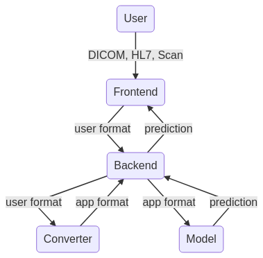

# Проверь свое сердце
*Приложение для предсказания заболеваний по электрокардиограмме*

## Description

Приложение <i>"Проверь свое сердце"</i> было разработанно студентами Школы анализа данных Яндекса в рамках курса <i>ML Engineering Practice</i>. Оно помогает найти патологии на электрокардиограмме. Приложение доступно по ссылке:

  <a href="http://check-ecg.ru"><b>Проверь свое сердце</b></a>

ПРЕДУПРЕЖДЕНИЕ: Предлагаемая система не является системой поддержки принятия врачебного решения и не может заменить врача.
В случае необходимости обращайтесь к квалифицированному кардиологу.

## Project Structure

Приложение <i>"Проверь свое сердце"</i> представляет собой клиент-серверное приложение, основанное на микросервисной архитектуре. Оно состоит из следующих компонентов:

- Frontend
- Backend
- [Converter](./converter/README.md)
- [Model](./model/README.md)

  

Рисунок 1. Взаимодействие компонентов

Каждая компонета по большей части независима и представляет собой изолированное приложение. Так, например, компонента <code>Model</code> отвечает за автоматическую идентификацию нарушений ритма/морфологии в ЭКГ с 12 отведениями. Идентификация осуществляется посредством нейросетевого классификатора. Компонента <code>Converter</code> отвечает за преобразование входных данных пользователя (DICOM/HL7 файл или изображение) во внутренний формат приложения. Более подробное описание функционирования каждой компоненты представленно в соответствующем разделе.

## Installation
Для простого поднятия всех компонентов приложения достаточно выполнить:

`sudo docker-compose up`

Поднимутся следующие 4 докер-образа
- Frontend
- Backend
- Photo to signal encoder (ML)
- Disease Classification by ECG (ML)

Для запуска каждого модуля отдельно следует смотреть в README.md конкретного модуля

## Team

Куратор:  
[Золотых Николай Юрьевич](https://github.com/NikolaiZolotykh)  
  
Developers:
- [Антонов Дмитрий](https://github.com/Lashby8)
- [Рябикин Николай](https://github.com/ryabsky)  
- [Хлевнов Олег](https://github.com/khlevnov)  
- [Чуркин Андрей](https://github.com/2-71-churkin)
  
## Licence

